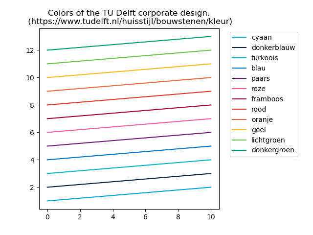

Pypaperutils - Useful functions for creating paper-ready figures in python
==============================

A personal collection of funcions for creating nice figures that can be exported to latex. 
- Colors of the TU Delft corporate image
- more functions to come ...



### Disclaimer

The package is under development. It may contain bugs and sections of unused or insensible code. Major changes to this package are planned for the time to come. A proper API documentation is still missing. 

## Installation

1. Clone this repository. 
   
   ```
   git clone  https://github.com/chrismo-schmidt/pypaperutils.git
   ```

2. Install the package and it's dependencies. Refer to `pyproject.toml` for an overview of the dependencies. 
   
   ```
   cd ./pypaperutils
   pip install . 
   ```

## Authors

- Christoph M. Schmidt, c.m.schmidt@tudelft.nl

License
--------------------

This package is licensed under the terms of the [MIT license](https://github.com/chrismo-schmidt/cyclistsocialforce/blob/main/LICENSE).

## Project Organization

```
.
├── pyproject.toml
├── LICENSE
├── README.md
└── src
    └── design
```
